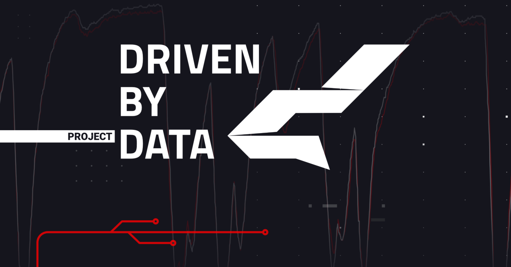
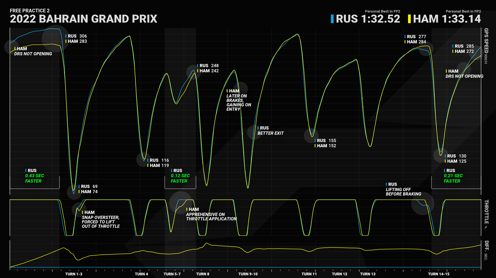
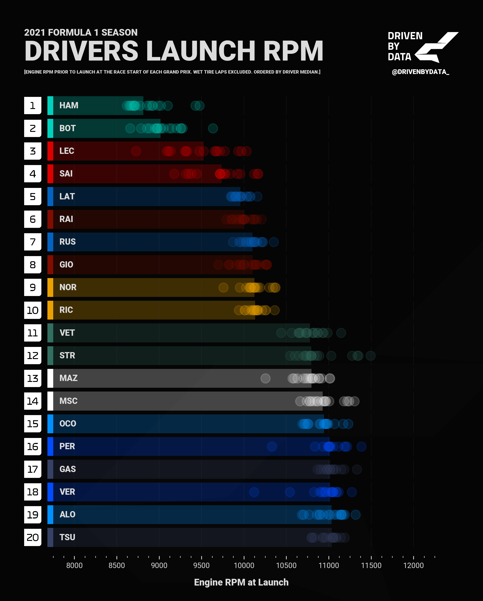
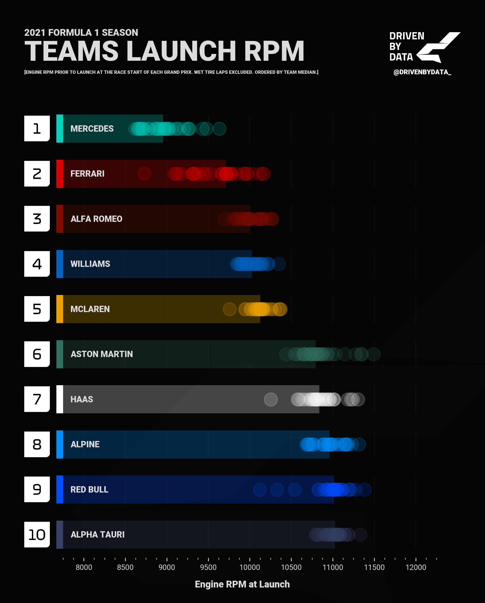

Tools for plotting and data analysis on telemetry data logged during Formula 1 Grand Prix weekends since 2018. The data is obtained through [Fast F1](https://github.com/theOehrly/Fast-F1), which builds on the [Ergast Developer API](http://ergast.com/mrd/).

## Examples

### Lap Comparison

### Engine RPM at Launch

|  |  |
| :---------------------------------------------------------------------: | :-----------------------------------------------------------------: |

## Bugs and Issues

Work in progress 🚧
